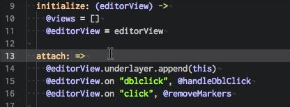
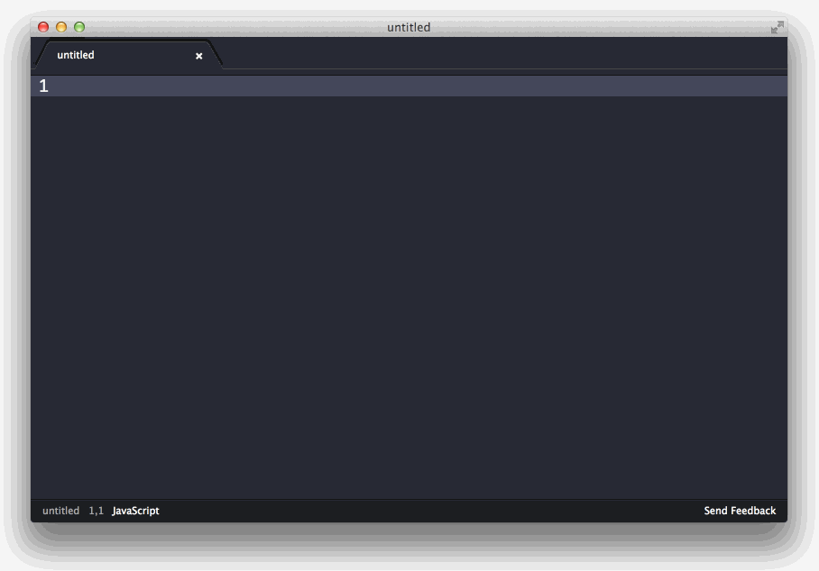
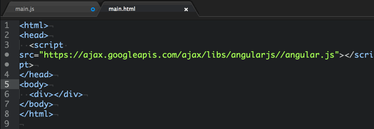

# My list of atom packages

## [atom-beautify](https://atom.io/packages/atom-beautify)

The most used beautifier package.

Beautify HTML, CSS, JavaScript, PHP, Python, Ruby, Java, C, C++, C#, Objective-C, CoffeeScript, TypeScript, Coldfusion, and SQL in Atom

Install: `apm install atom-beautify`


## [atom-easy-jsdoc](https://atom.io/packages/atom-easy-jsdoc)

best JSDoc style comments for javascript development.

Control-Shift-d or Control-Shift-j to add comment templates.

```javascript
/**
 * functionComment - description
 *  
 * @param  {type} argA description
 * @param  {type} argB description
 * @param  {type} argC description
 * @return {type}      description
 */
function functionComment (argA, argB, argC) {
    return 'javadoc';
}
```

## [color-picker](https://atom.io/packages/color-picker)


Because, ofc...


## [emmet]((https://atom.io/packages/emmet))

Used to be zen-coding.

no explanation needed.


## [highlight-selected](https://atom.io/packages/highlight-selected)

Highlights the current word selected when double clicking.



## [javascript-snippets](https://atom.io/packages/javascript-snippets)

JavaScript & NodeJS Snippets for Atom.




## Linters

[linter](https://atom.io/packages/linter)

[linter-htmlhint](https://atom.io/packages/linter-htmlhint)

[linter-jshint](https://atom.io/packages/linter-jshint)

[linter-sass-lint](https://atom.io/packages/linter-sass-lint)

## [merge-conflicts](https://atom.io/packages/merge-conflicts)

Resolve git conflicts within Atom.


## [minimap](https://atom.io/packages/minimap)

A preview of the full source code.

install: `apm install minimap`

## [angularjs](https://atom.io/packages/angularjs)

Adds syntax highlighting and snippets to AngularJS in Atom.



## [react](https://atom.io/packages/react)

React.js (JSX) language support, indentation, snippets, auto completion, reformatting.


## [seti-icons](https://atom.io/packages/seti-icons)

The awesome icons provided by Seti UI theme.


## [imdone](https://atom.io/packages/imdone-atom)

A hackable task-board for TODOs, FIXMEs, HACKs, etc in your code.

install: `apm install imdone-atom`


## Themes

**UI-Theme:** [Atom Material](https://atom.io/themes/atom-material-ui)


**Syntax Theme:** [Atom Dark](https://atom.io/themes/atom-dark-syntax)


